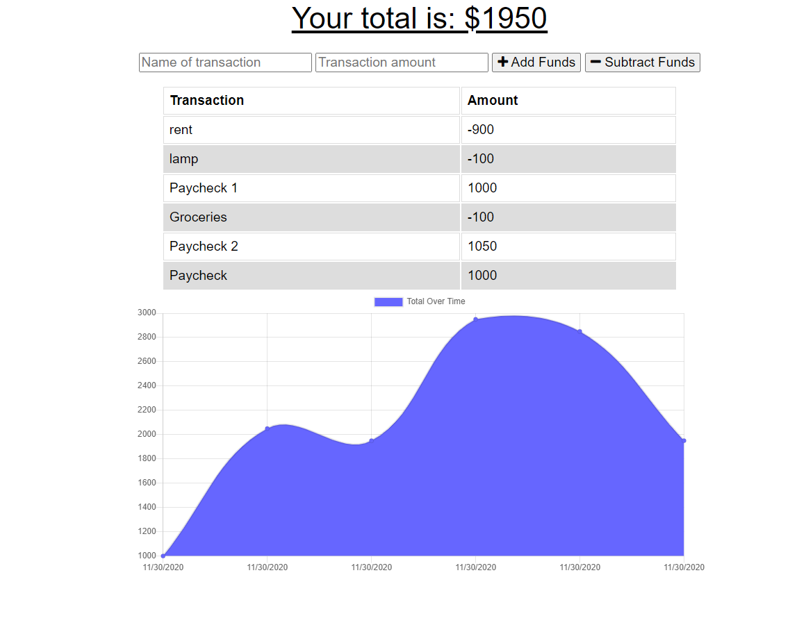

# 📈 [Budget-Tracker-Online-Offline](https://still-harbor-43545.herokuapp.com/) 📉
A full stack app that allows you to keep track of your money wherever you are! 

  

This app uses Javascript, node.js and Mondo DB to store all entries.  This app was created to keep track of all the money you earn and spend.  Upon opening the app, you will notice there is a transaction box with a transaction amount box next to it.  As you fill out these required fields, a chart will generate based on the input.  When each input is created, it will store to mongo DB.  If you are "offline", all entries will be stored in the browers IndexedDb and when the browser senses it is online, it will automatically add the entries, update the chart and then store all information to the database.

You can click on the Title of this page or [here](https://still-harbor-43545.herokuapp.com/) to view deployed app through Heroku.

Created by: Vincent Doria Jr.
